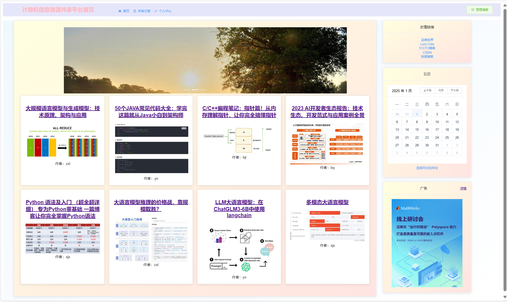

# 计算机信息资源共享平台

## 🚀 项目简介
一个基于Spring Boot + Vue.js的现代化计算机技术文章分享平台，为用户提供优质的技术内容分享、学习和交流服务。

## ✨ 主要功能
- 🔐 用户认证系统（JWT + 角色权限）
- 📝 文章发布与管理（富文本编辑器）
- 🏷️ 文章分类与标签
- ⭐ 文章收藏与分享
- 👥 用户管理与权限控制
- 📱 响应式设计，支持多端访问
- 📊 系统监控与日志记录

## 🛠️ 技术架构

### 后端技术栈
- **核心框架**: Spring Boot 2.7.15
- **数据库**: MySQL 8.0
- **ORM框架**: MyBatis + PageHelper
- **连接池**: Druid
- **安全认证**: JWT (Java-JWT 3.10.3)
- **日志框架**: Logback
- **构建工具**: Maven
- **Java版本**: JDK 20

### 前端技术栈
- **核心框架**: Vue.js 2.6.14
- **UI组件库**: Element UI 2.15.14
- **路由管理**: Vue Router 3.5.1
- **状态管理**: Vuex 3.6.2
- **HTTP客户端**: Axios 1.7.9
- **富文本编辑器**: WangEditor 4.7.15
- **构建工具**: Vue CLI 5.0

## 📁 项目结构
```
computer-resource-sharing-platform/
├── zhouxuelian8/                 # 后端Spring Boot项目
│   ├── src/main/java/            # Java源代码
│   ├── src/main/resources/       # 配置文件
│   ├── src/test/                 # 测试代码
│   └── pom.xml                   # Maven配置
├── zhouxuelian8 前端/            # 前端Vue.js项目
│   ├── src/                      # 源代码
│   ├── public/                   # 静态资源
│   └── package.json              # 依赖配置
├── lmodeldb.sql                  # 数据库脚本
├── docs/                         # 项目文档
├── screenshots/                  # 项目截图
└── README.md                     # 项目说明
```

## 🚀 快速开始

### 环境要求
- JDK 20+
- Node.js 16+
- MySQL 8.0+
- Maven 3.6+

### 1. 克隆项目
```bash
git clone https://github.com/LIANLIAN-Serendipity/computer-resource-sharing-platform.git
cd computer-resource-sharing-platform
```

### 2. 后端启动
```bash
cd zhouxuelian8/zhouxuelian8
# 配置数据库连接
vim src/main/resources/application.properties
# 启动应用
mvn spring-boot:run
```

### 3. 前端启动
```bash
cd "zhouxuelian8 前端/zhouxuelian8"
# 安装依赖
npm install
# 启动开发服务器
npm run serve
```

### 4. 访问应用
- 前端: http://localhost:8080
- 后端API: http://localhost:8089/zhouxuelian8

## 📖 详细文档
- [部署说明](./docs/部署说明.md)
- [API接口文档](./docs/API接口文档.md)
- [数据库设计文档](./docs/数据库设计文档.md)
- [开发指南](./docs/开发指南.md)

## 🖼️ 项目截图



## 🤝 贡献指南
欢迎提交Issue和Pull Request！

## 📄 许可证
本项目采用 [MIT License](./LICENSE) 许可证。

## 👨‍💻 作者
**zhouxuelian** - 计算机信息资源共享平台开发者

## 🙏 致谢
感谢所有为这个项目做出贡献的开发者！ 